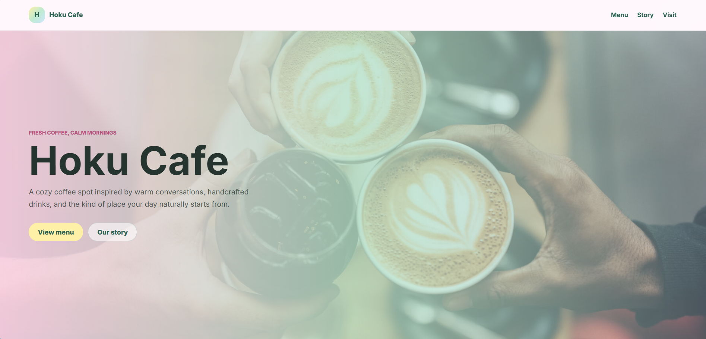
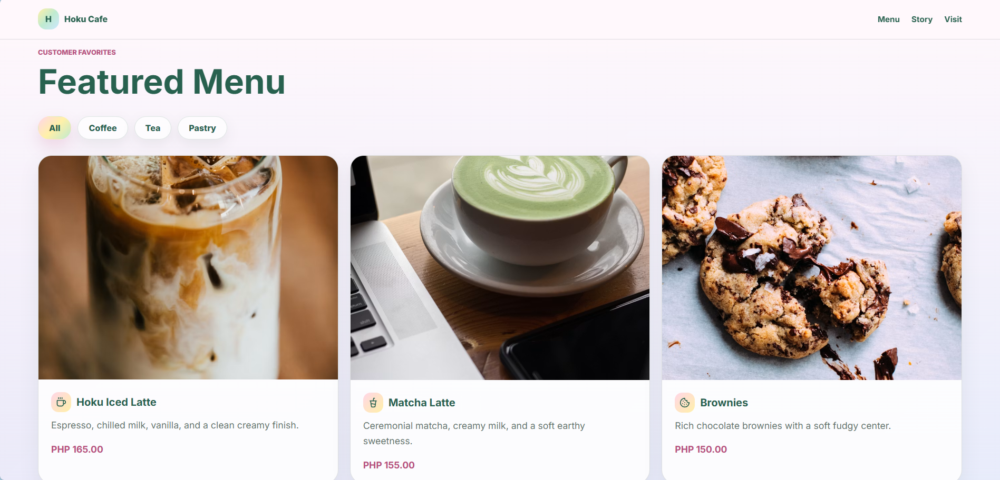

# Hoku Cafe

Hoku Cafe is a pastel coffee shop website built with React, Vite, Express, and MySQL.

## Screenshots

### Homepage



### Menu and Order




## Tech Stack

- React
- Vite
- Express
- MySQL
- lucide-react

## Run Locally

Install dependencies:

```cmd
npm install
```

Start the backend API:

```cmd
npm run server
```

Start the frontend:

```cmd
npm run dev
```

Frontend:

```text
http://127.0.0.1:5173
```

Backend health check:

```text
http://127.0.0.1:3001/api/health
```

Menu API:

```text
http://127.0.0.1:3001/api/menu
```

## MySQL Setup

Create a `.env` file using `.env.example`:

```cmd
copy .env.example .env
```

Update the values if your MySQL username or password is different.

Run the SQL file in MySQL:

```cmd
mysql -u root -p < server\schema.sql
```
